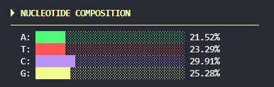

<p align="center">
  
</p>

GCScope is a lightweight bioinformatics tool written in Python for analyzing the GC content of DNA sequences provided in FASTA format. 
It computes both global GC percentage and local GC content using a sliding window approach. The app generates a graph of the GC content percentage across the sequence and calculates the CpG and GpC islands count per 100 nucleotides (*nt*) in the sequence.

 
 


## Key Features
- **Global and Local GC Analysis**: Calculates the total GC percentage and generates a dynamic graph of local GC content using a sliding window approach.
- **CpG Island Visualization**: Counts CpG and GpC islands per 100 nucleotides in the sequence.
- **Nucleotide Statistics**: Presents the percentage breakdown of individual nucleotides in a clear bar chart.
- **Visualization**: Generates and automatically saves plots to a dedicated output folder.

## Output and Visualizations
**GC Content Across Sequence** - This plot shows the local GC content percentage along the analyzed DNA sequence. The X-axis represents nucleotide position. The Y-axis shows the GC ratio within a sliding window. The color intensity corresponds to GC richness - brighter regions indicate higher GC concentration, which can correlate with gene-dense or regulatory regions.

<p align="center">
  
</p>

**CpG and GpC Island Counts** - This visualization highlights the frequency of CpG and GpC dinucleotides across the sequence (The CpG sites or CG sites are regions of DNA where a cytosine nucleotide is followed by a guanine nucleotide in the linear sequence of bases). The chart shows the number of CpG and GpC islands per 100 nucleotides, providing a quick overview of methylation-related hotspots or GC-rich motifs. Such patterns can be useful in epigenetic analysis or identifying promoter regions.

<p align="center">
  
</p>

**Nucleotide Composition Summary** - The program also generates a Nucleotide Composition Summary, which visualizes the overall proportion of each nucleotide type (*A, C, T, and G*) in the analyzed sequence. This bar chart provides a quick overview of the global composition balance and highlights potential biases or sequence characteristics.

<p align="center">  </p>

## How to use
**1. Clone the repository:**
```bash
git clone https://github.com/stanuch/GCScope.git
cd GCScope
```
**2. Install dependencies**
```bash
pip install -r requirements.txt
```
**3. Prepare your FASTA file**
- Place your sequence files in the [`sequences/`](sequences/) folder
- Use the .fasta format
- When running the program, enter only the file name without the extension (e.g., for seq1.fasta, just type seq1)

**4. Run the program**
```bash
python src/main.py
```

## Theoretical background
**Base Pairing and DNA Stability**
DNA stability is determined in part by the hydrogen bonding between complementary bases. Adenine (A) pairs with Thymine (T) through two hydrogen bonds, while Guanine (G) pairs with Cytosine (C) through three. Because G–C pairs form an additional bond, regions with higher GC content are more thermodynamically stable and exhibit higher melting temperatures. Consequently, GC-rich sequences tend to resist denaturation and play an important role in determining the physical and biochemical properties of DNA.

**PCR and Molecular Cloning**
In polymerase chain reaction (PCR) and cloning experiments, the GC content of a DNA sequence can influence both amplification efficiency and primer design. GC-rich templates often require higher denaturation temperatures to ensure complete strand separation. Optimal primers typically contain 40–60% GC content, which provides stable hybridization without excessive secondary structure formation.

**CpG Islands**
CpG islands are genomic regions typically longer than 200 base pairs, with a GC content of at least 50% and an observed-to-expected CpG ratio greater than 0.6. These regions frequently occur near gene promoters and transcription start sites. Their presence and methylation status are key indicators in studies of gene regulation, epigenetic modification, and chromatin accessibility. CpG island analysis is therefore a fundamental component of computational genomics and epigenetic research.

## References

- Saxonov, S., et al. (2006). A genome-wide analysis of CpG dinucleotides in the human genome distinguishes two distinct classes of promoters. PNAS.

- Jabbari, K., & Bernardi, G. (2004). Cytosine methylation and CpG, TpG (CpA) and TpA frequencies. Gene.

- Coutinho, T. J. D., et al. (2015). Homology-independent metrics for comparative genomics. Computational and Structural Biotechnology Journal.

