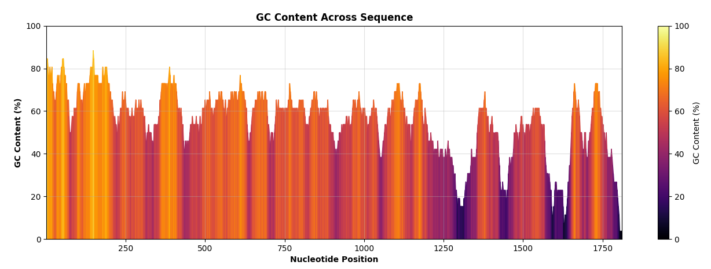
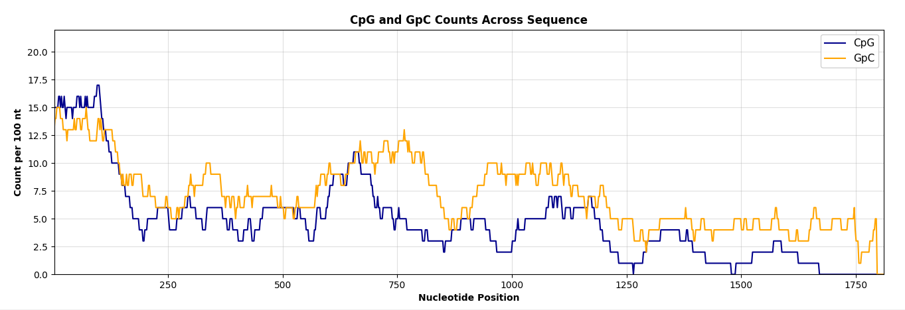
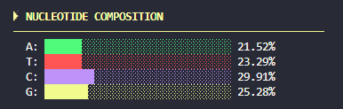

<p align="center">
  
</p>

GCScope is a lightweight bioinformatics tool for analyzing the GC content of DNA and RNA sequences provided in FASTA format. It computes global GC percentage, local GC content using a sliding window approach, nucleotide composition, and CpG/GpC island frequency — then generates plots and exports the results to CSV, TSV, or JSON.


# Table of contents

* [Background](#background)
    * [GC content and DNA stability](#gc-content-and-dna-stability)
    * [CpG islands](#cpg-islands)
* [How it works](#how-it-works)
    * [Input](#1-input)
    * [Analysis](#2-analysis)
    * [Visualization](#3-visualization)
    * [Export](#4-export)
* [Output examples](#output-examples)
* [Project structure](#project-structure)
* [Installation](#installation)
* [Usage](#usage)
* [References](#references)
* [License](#license)


# Background

### GC content and DNA stability

DNA stability is determined in part by the hydrogen bonding between complementary bases. Adenine (A) pairs with Thymine (T) through two hydrogen bonds, while Guanine (G) pairs with Cytosine (C) through three. Because G–C pairs form an additional bond, regions with higher GC content are more thermodynamically stable and exhibit higher melting temperatures. Consequently, GC-rich sequences tend to resist denaturation and play an important role in determining the physical and biochemical properties of DNA.

In polymerase chain reaction (PCR) and cloning experiments, the GC content of a DNA sequence can influence both amplification efficiency and primer design. GC-rich templates often require higher denaturation temperatures to ensure complete strand separation. Optimal primers typically contain 40–60% GC content, which provides stable hybridization without excessive secondary structure formation.

GCScope calculates global GC percentage and visualizes local variation across the sequence using a sliding window, making these patterns immediately visible.


### CpG islands

CpG islands are genomic regions typically longer than 200 base pairs, with a GC content of at least 50% and an observed-to-expected CpG ratio greater than 0.6. These regions frequently occur near gene promoters and transcription start sites. Their presence and methylation status are key indicators in studies of gene regulation, epigenetic modification, and chromatin accessibility. CpG island analysis is therefore a fundamental component of computational genomics and epigenetic research.

GCScope counts both CpG (cytosine → guanine) and GpC (guanine → cytosine) dinucleotides per 100 nucleotides in a sliding window, providing a quick overview of methylation-related hotspots across the sequence.


# How it works

### 1. Input

Place a FASTA file (`.fasta`) in the `sequences/` directory. When you run the program, it asks for the filename (without extension). The tool supports both DNA and RNA sequences — RNA is detected automatically by the presence of Uracil (U) instead of Thymine (T).


### 2. Analysis

Four analyses are performed on the loaded sequence:

- **Global GC content** — the overall percentage of G and C nucleotides in the sequence
- **Nucleotide composition** — percentage of each nucleotide (A, T/U, C, G) displayed as a visual bar chart in the terminal
- **Sliding window GC content** — GC percentage computed in a window of configurable size (default: 26 nt) that moves across the sequence with a configurable step (default: 2 nt)
- **CpG and GpC island counts** — number of CpG and GpC dinucleotides per 100 nucleotides, computed in a 100 nt sliding window


### 3. Visualization

Two plots are generated and saved automatically to a per-run output folder:

- **GC Content Across Sequence** — an area chart colored by GC intensity using the *inferno* colormap, where brighter regions indicate higher GC concentration
- **CpG and GpC Counts** — a line chart comparing CpG and GpC frequencies along the sequence


### 4. Export

After the analysis completes, you can optionally export all results (summary statistics, nucleotide composition, sliding window data, and CpG/GpC data) to a file. Supported formats:

| Format | Description |
|--------|-------------|
| CSV    | Comma-separated, with section headers as comments |
| TSV    | Tab-separated, same structure as CSV |
| JSON   | Structured nested dictionary |

The exported file is saved alongside the graphs in the same run output folder.


# Output examples

**GC Content Across Sequence** — Local GC content percentage along the analyzed DNA sequence. The color intensity corresponds to GC richness — brighter regions indicate higher GC concentration, which can correlate with gene-dense or regulatory regions.

<p align="center">
  
</p>

**CpG and GpC Island Counts** — Frequency of CpG and GpC dinucleotides across the sequence. The chart shows the number of CpG and GpC islands per 100 nucleotides, providing a quick overview of methylation-related hotspots or GC-rich motifs.

<p align="center">
  
</p>

**Nucleotide Composition Summary** — The overall proportion of each nucleotide type (A, C, T, G) in the analyzed sequence, displayed as a bar chart directly in the terminal.

<p align="center">
  
</p>


# Project structure

```
GCScope/
├── sequences/               # Input FASTA files
│
├── src/                     # Python source code
│   ├── main.py              # CLI entry point and user interface
│   ├── analysis.py          # GC content, nucleotide stats, CpG/GpC analysis
│   ├── graph.py             # Plot generation (matplotlib)
│   └── export.py            # CSV/TSV/JSON export
│
├── output/                  # Generated results (one subfolder per run)
│
├── img/                     # Logo and README figures
├── requirements.txt         # Python dependencies
├── LICENSE                  # MIT
└── README.md
```

Each run creates a timestamped subfolder inside `output/`, keeping graphs and export files organized together.


# Installation

**1. Clone the repository:**
```bash
git clone https://github.com/stanuch/GCScope.git
cd GCScope
```

**2. Install dependencies:**
```bash
pip install -r requirements.txt
```

Dependencies: [Biopython](https://biopython.org/) (FASTA parsing), [matplotlib](https://matplotlib.org/) (plotting), [colorama](https://pypi.org/project/colorama/) (terminal colors).


# Usage

```bash
python src/main.py
```

The program will guide you through the analysis interactively:

1. Enter the name of your FASTA file (without `.fasta` extension)
2. Set the sliding window size (press Enter for default = 26)
3. Set the step size (press Enter for default = 2)
4. View the generated plots
5. Optionally export results to CSV, TSV, or JSON

All outputs are saved to `output/<sequence>_<timestamp>/`.


# References

- Saxonov, S., et al. (2006). A genome-wide analysis of CpG dinucleotides in the human genome distinguishes two distinct classes of promoters. *PNAS*.
- Jabbari, K., & Bernardi, G. (2004). Cytosine methylation and CpG, TpG (CpA) and TpA frequencies. *Gene*.
- Coutinho, T. J. D., et al. (2015). Homology-independent metrics for comparative genomics. *Computational and Structural Biotechnology Journal*.


# License

This project is licensed under the MIT License — see the [LICENSE](LICENSE) file for details.
